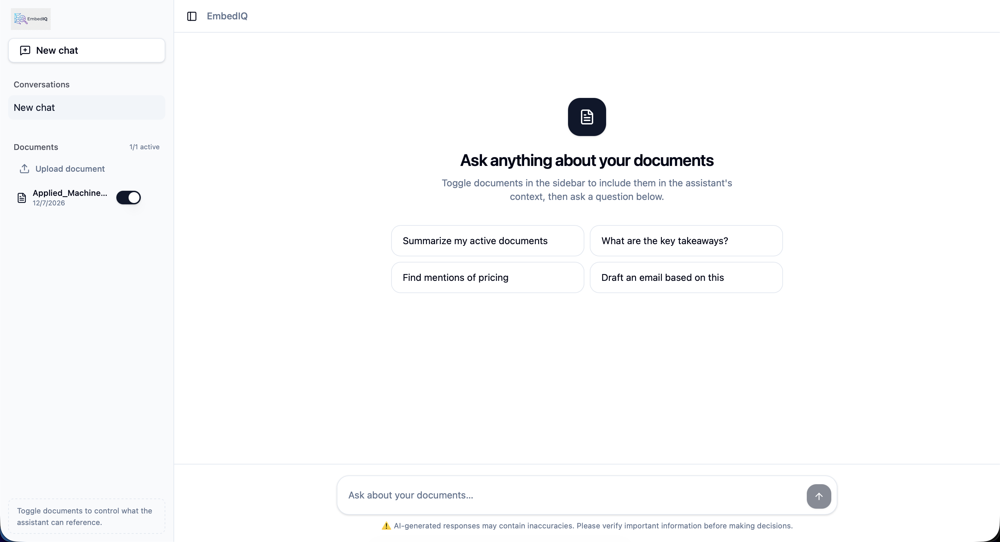

# EmbedIQ: Enterprise-Grade RAG Platform 🧠

[](https://github.com/AryanKharate/EmbedIQ-Rag/actions/workflows/ci.yml)


**EmbedIQ** is a full-stack, containerized AI platform demonstrating advanced Retrieval-Augmented Generation (RAG) capabilities. It allows users to ingest custom documents, perform high-accuracy semantic searches, and interact with the data through a modern, responsive chat interface. 

Designed with production-readiness in mind, it implements advanced retrieval techniques like **HyDE (Hypothetical Document Embeddings)**, **CRAG (Corrective RAG)**, and **Cohere Reranking** to ensure top-tier response quality.

---

## 🚀 Key Features

*   **Advanced RAG Pipeline:** Implements sophisticated retrieval strategies including HyDE and CRAG for superior context retrieval.
*   **Vector Search:** Utilizes **Qdrant** for lightning-fast, high-dimensional vector similarity search.
*   **Modern Frontend:** Built with **React 19**, **TanStack Start**, and beautiful **shadcn/ui** components for a seamless user experience.
*   **Robust Backend:** Powered by **Django** and Python 3.12, organized using enterprise "Two Scoops" design patterns.
*   **Built-in Evaluation:** Includes automated evaluation scripts (SQuAD) to continuously validate RAG accuracy and retrieval performance.
*   **Fully Containerized:** One-command deployment using **Docker Compose**, orchestrating the frontend, backend, Nginx, PostgreSQL, and Qdrant.

---

## 🛠️ Technology Stack

**Frontend**
*   React 19 & TypeScript
*   TanStack Start & TanStack Query (React Query)
*   Tailwind CSS & shadcn/ui
*   Vite

**Backend**
*   Python 3.12 & Django
*   Qdrant (Vector Database)
*   PostgreSQL (Relational Database)
*   HuggingFace / OpenAI Integrations

**Infrastructure & DevOps**
*   Docker & Docker Compose
*   Nginx (Reverse Proxy)
*   GitHub Actions (CI Pipeline)

---

## ⚙️ Local Development Setup

The entire stack is containerized, making local setup incredibly straightforward. 

### Prerequisites
*   [Docker Desktop](https://www.docker.com/products/docker-desktop/) installed and running.
*   Git

### 1. Clone the repository
```bash
git clone https://github.com/AryanKharate/EmbedIQ-Rag.git
cd EmbedIQ-Rag
```

### 2. Configure Environment Variables
Create a `.env` file in the root directory and add the necessary API keys and database credentials:

```env
# Database Credentials (matching docker-compose.yml)
DATABASE_URL=postgres://embediq_user:embediq_pass@db:5432/embediq_db

# Qdrant URL
QDRANT_URL=http://qdrant:6333

# Add your AI Provider API Keys here (e.g., OpenAI, Cohere, etc.)
OPENAI_API_KEY=your_openai_api_key_here
```

### 3. Spin up the cluster
Run the following command to build the Docker images and start all 5 microservices (Frontend, Backend, Database, Qdrant, Nginx):

```bash
docker compose up --build
```

### 4. Access the Application
Once the containers are running, the application will be available at:
*   **Frontend UI:** [http://localhost](http://localhost)
*   **Django Backend API:** [http://localhost:8000](http://localhost:8000)
*   **Qdrant Dashboard:** [http://localhost:6333/dashboard](http://localhost:6333/dashboard)

---

## 📚 Usage Guide 

### Ingesting Documents
To feed knowledge into the vector database, use the custom Django management command. Open a new terminal and run the command inside the running `web` container:

```bash
# Example: Ingesting a text file
docker compose exec web python manage.py ingest path/to/your/document.txt
```

### Running RAG Evaluations
To run the automated evaluation suite to benchmark the RAG pipeline's accuracy:
```bash
docker compose exec web python scripts/squad_eval.py
```

---

## 📁 Architecture Overview

```text
EmbedIQ/
├── apps/               # Django backend domains (retrieval, generation, conversations)
├── config/             # Django core configuration & settings
├── frontend/           # React / TanStack application
├── scripts/            # Evaluation (SQuAD) and validation scripts
├── tests/              # Backend API test suite
├── docker-compose.yml  # Multi-container orchestration
└── Dockerfile          # Backend container definition
```

---

## 🔄 Continuous Integration (CI)

This project is configured with a robust **GitHub Actions** CI pipeline. On every push and Pull Request, it automatically:
1. Runs **Ruff** to enforce Python style guidelines and lint the Django backend.
2. Runs **ESLint** to validate the React frontend.
3. Performs a strict **Vite Build** check to ensure TypeScript compiles correctly.

---
*Designed and built by [Aryan Kharate](https://github.com/AryanKharate).*
